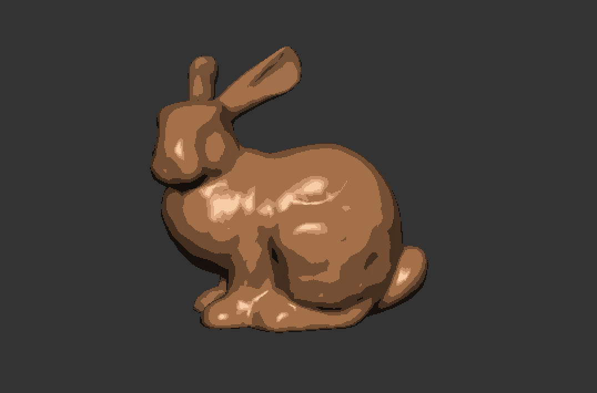
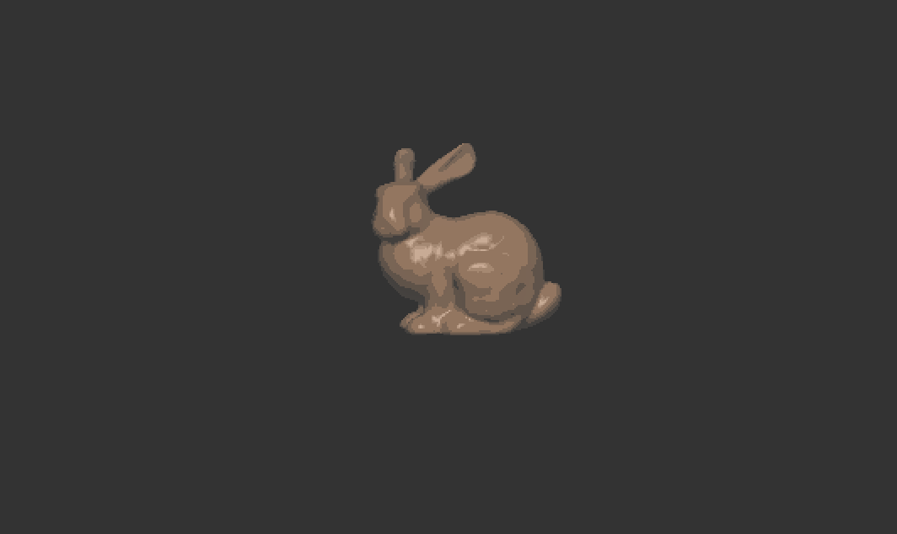

# Toon Shading with Distance Fog

This project demonstrates a stylized "toon" shader combined with a distance fog effect in OpenGL. You can load different OBJ models, navigate around the scene with a simple camera, and observe how objects change with distance and quantized lighting.

---

## Table of Contents

1. [Overview](#overview)
2. [Features](#features)
3. [Screenshots](#screenshots)
4. [External Resources](#external-resources)
5. [Requirements and Dependencies](#requirements-and-dependencies)
6. [Setup and Installation](#setup-and-installation)
7. [Running the Project](#running-the-project)
8. [Usage](#usage)
9. [Future Improvements](#future-improvements)

---

## Overview

This application renders a 3D model with:

- **Toon (Cel) Shading**: Lighting is quantized into discrete levels, giving objects a cartoonish appearance.
- **Distance Fog**: Objects gradually fade to a fog color as they move away from the camera.

A default rabbit model (`bunny_centered.obj`) is loaded on startup. The camera can move around via arrow keys, letting you see the combined effects of toon shading and distance fog from various distances.

---

## Features

- **Dynamic OBJ Loading**: Specify which OBJ model to load at runtime (`./prog ../common/objects/some_model.obj`).
- **Adjustable Toon Shading**: Easily configure the number of quantization levels (e.g., 4, 5, or more).
- **Distance Fog**: Fog color, start, and end distances can be changed in the fragment shader or via uniforms.
- **Wireframe Toggle**: Press `W` at runtime to switch between a filled or wireframe rendering mode.
- **Camera Navigation**: Arrow keys for movement (forward, backward, left, right).

---

## Screenshots

**Close up:**


**Further away:**


---

## External Resources

- [Toon Shader Discussions on Reddit](https://www.reddit.com/r/opengl/comments/kghh29/toon_shader/)
- [Toon Shader Tutorial Video](https://www.youtube.com/watch?v=h15kTY3aWaY)
- [Fog Tutorials & Examples](https://vicrucann.github.io/tutorials/osg-shader-fog/)

---

## Requirements and Dependencies

1. **C++17 (or later) compiler** (e.g., `g++`, `clang++`, etc.).
2. **[SDL2](https://www.libsdl.org/)**:
   - Make sure SDL2 is installed on your system.
   - Typically available via package manager (e.g., `sudo apt-get install libsdl2-dev` on Ubuntu).
3. **[Python 3](https://www.python.org/)** for the build script (`build.py`).
4. **[glad](https://glad.dav1d.de/)**: The repository already includes the generated GLAD files if you followed the typical setup.
5. **CMake** (if your `build.py` relies on a CMake-based build process; some setups just call `g++` directly).

---

## Setup and Installation

1. **Clone this repository**:
   ```bash
   git clone https://github.com/maggieliu-codes/OpenGL-Toon-Shading-Fog.git
   ```
2. **Navigate to the project folder**:
   ```bash
   cd project_code
   ```
3. **Install SDL2** (if not already installed). For example, on Ubuntu or Debian-based systems:
   ```
   sudo apt-get update
   sudo apt-get install libsdl2-dev
   ```
   For other operating systems, please refer to the SDL2 documentation.

---

## Running the Project

1. **Build**:
   ```bash
   python3 build.py
   ```
   This will compile the source files and produce an executable named `prog`.
2. **Execute**:
   ```bash
   ./prog
   ```
   By default, the rabbit model (`bunny_centered.obj`) is loaded. Use the arrow keys to move the camera and observe the distance fog.
3. **Loading Other Models**:

   ```bash
   ./prog ../common/objects/your_chosen_model.obj
   ```

   Replace `your_chosen_model.obj` with any OBJ file in the `common/objects` directory.

---

## Usage

- Arrow Keys: Move the camera forward, backward, left, and right.
- W Key: Toggle wireframe mode.
- Q Key: Quit the application (if implemented as such).
- Mouse Movement: Rotates the camera view (currently set up in the code to track mouse motion).

---

### Modifying Toon Shading

Inside the fragment shader (`frag.glsl`):

```glsl
 float levels = 4.0; // Adjust this to change how many 'bands' of shading exist.
```

Increasing levels will create smoother transitions; decreasing makes stronger cartoon bands.

### Adjusting Fog Settings

Also in `frag.glsl`:

```glsl
float fogStart = 5.0;    // Distance where fog starts
float fogEnd = 20.0;     // Distance where fog is fully opaque
vec3 fogColor = vec3(0.5, 0.5, 0.5); // Fog color (gray)
```

Tweak these values for different fog distances and colors.

---

## Future Improvements

- GUI Sliders for adjusting levels, fogStart, fogEnd, and fogColor in real time.
- Animated Model or multiple objects with different shaders.
- Implement a skybox or environment mapping to enhance scene realism.
- Add stencils or outlines for stronger cartoon edges.

---

### Happy Rendering!
